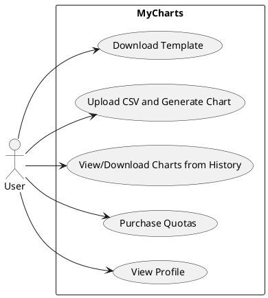

# Software Requirements Specification (SRS)

# MyCharts Application

---

## 1. Introduction

### 1.1 Purpose  
The MyCharts Application is a web-based service designed to enable users with minimal technical expertise to generate, manage, and download charts in various formats. It simplifies chart creation by providing templates for source data, supporting data uploads. It uses the Highcharts library for chart generation.

### 1.2 Scope  
This application allows users to:  
- Download CSV templates for supported chart types.  
- Upload CSV files to generate charts.  
- Save and download charts in PDF, PNG, SVG, and HTML formats.  
- Purchase quotas for chart creation.
- View and download generated charts.

### 1.3 Definitions, Acronyms, and Abbreviations  
- **CSV**: Comma-Separated Values file format.  
- **Quota**: A limit on the number of charts a user can create.  
- **Highcharts**: JavaScript library used for chart rendering.  

### 1.4 References  
- Highcharts Library: https://www.highcharts.com  
- Google Authentication API: https://developers.google.com/identity  
- CSV Format Specification: https://tools.ietf.org/html/rfc4180  

### 1.5 Overview  
This document outlines functional and non-functional requirements, use cases, and interface specifications for the MyCharts Application.

---

## 2. System Overview

### 2.1 Product Perspective  
MyCharts is a SaaS (Software as a Service) standalone web application. It will be offered online and produce revenue by selling credits for chart generation.

### 2.2 Product Functions  
1. User authentication via Google accounts.  
2. Download CSV templates for chart types.  
3. Upload CSV files to generate charts.  
4. Save charts in PDF, PNG, SVG, and HTML formats.  
5. Display and manage user-generated charts.  
6. Charge for quotas needed to create charts.  

### 2.3 User Characteristics  
Primary users include educators, students, and professionals needing simple chart generation. No coding or technical skills are required.

### 2.4 Operating Environment  
- **Frontend**: Modern browsers (Chrome, Firefox, Safari).  
- **Backend**: Application Server with Node.js or Python runtime and database server(s) as needed.  
- **Network**: Internet connectivity required for service offering.  

### 2.5 Assumptions and Dependencies  
- Google OAuth is available for user authentication.  
- Highcharts library is accessible for chart rendering.  
- Users follow the CSV structure.  

---

## 3. Functional Requirements

### 3.1 Functional Requirements Specification  
1. Authenticate users via Google accounts.  
2. Allow download of CSV templates for 3 supported chart types (Basic line, Line with annotations, Basic column).  
3. Upload CSV file with the user data for chart generation.
4. Validate uploaded CSV files against the template structure, data types, and mandatory data existence.  
5. Generate charts with data from the CSV file uploaded by the user, using Highcharts.  
6. Save charts to the server in PDF, PNG, SVG, and HTML formats.  
7. Display a dashboard with the history of user-generated charts, including chart previews.  
8. Download selected chart type.
9. Charge quotas for chart creation.  
10. Allow users to delete or download charts. 
11. Sell quotas and receive payment by a payment gateway
12. Maintain user profiles containing the following data: Name (from Google account), profile picture (from Google account), email (from Google account), remaining quota, account creation timestamp, last login timestamp.  
13. Display user's profile info, including remaining quotas.


### 3.2 Use Cases  

#### 3.2.1 Use Case Diagram  


#### 3.2.2 Use Case 1: Download CSV Template  
- **Actors**: User  
- **Preconditions**:  
  a) User is logged in.  
- **Main Flow**:  
  1. User navigates to the "Create Chart" section and selects a chart type from a dropdown menu.  
  2. System displays the 3 supported chart types.  
  3. User clicks "Download Template" for the selected chart type.  
  4. System provides a CSV file for each chart type, containing:  
     - Predefined column headers matching the chart type.  
     - Sample data rows, to be replaced by the user's actual data.  
     - Chart formatting parameters.  
  5. CSV file is downloaded to the user's device.   
- **Post-conditions**:  
  a) CSV template is saved locally on the end-user's machine for data entry.

- **Activity Diagram**:
  ```plantuml
    start
    :User selects chart type from dropdown;
    if (Chart type available?) then (yes)
    :Generate CSV template (headers + examples + guidelines);
    :Download CSV to device;
    else (no)
    :Display "Chart type unavailable";
    endif
    stop
  ```

#### 3.2.3 Use Case 2: Upload CSV and Generate Chart  
- **Actors**: User  
- **Preconditions**:  
  a) User has a valid CSV file formatted per the template.  
  b) User has remaining quota for chart creation.  
- **Main Flow**:  
  1. User navigates to the "Generate Chart" section and uploads a CSV file.  
  2. System performs validation checks:  
     - Column headers match the selected chart type.  
     - Data types are correct (e.g., numeric values for data).  
     - No empty mandatory fields.  
  3. System renders a preview of the chart using Highcharts.  
  4. User confirms the preview.  
  5. System saves the chart to the server in all supported formats (PDF, PNG, SVG, HTML).  
  6. User's quota is decremented by 1.  
- **Alternate Flows**:  
  - **Invalid CSV**: System highlights errors (e.g., "Column 'Revenue' missing") and blocks submission.  
  - **Quota Exhausted**: System displays "Quota Limit Reached: Upgrade to create more charts."  
- **Post-conditions**:  
  a) Chart is stored on the server.  
  b) Chart appears in the user's dashboard.  

- **Activity Diagram**:
    ```plantuml
    start
    :User uploads CSV file;
    partition Validation {
    if (Headers match chart type?) then (yes)
        if (Data types valid?) then (yes)
        if (Mandatory fields filled?) then (yes)
            if (Quota available?) then (yes)
            :Render chart preview;
            else (no)
            :Display "Quota Exhausted";
            stop
            endif
        else (no)
            :Highlight "Mandatory fields missing";
            stop
        endif
        else (no)
        :Highlight "Invalid data types";
        stop
        endif
    else (no)
        :Highlight "Column headers mismatch";
        stop
    endif
    }
    :User confirms preview;
    :Save chart (PDF/PNG/SVG/HTML);
    :Decrement quota by 1;
    stop
    ```

#### 3.2.4 Use Case 3: View/Download Chart from History  
- **Actors**: User  
- **Preconditions**:  
  a) User is logged in.  
  b) At least one chart has been previously generated by the logged in user.  
- **Main Flow**:  
  1. User navigates to the "Chart History" section in the dashboard.  
  2. System displays a list of all previously generated charts with timestamps.  
  3. User selects a chart from the list.  
  4. System displays a preview and provides download options (PDF, PNG, SVG, HTML).  
  5. User selects a format to download the chart.  
- **Alternate Flow**:  
  - If no charts exist, the system displays a message: "No charts found in history."  
- **Post-conditions**:  
  a) The selected chart is downloaded in the chosen format.  

- **Activity Diagram**:
    ```plantuml
    start
    :User navigates to Chart History;
    if (Charts exist?) then (yes)
    :Display list with charts;
    :User selects a chart;
    :Show preview and download options;
    :User selects format;
    :Download chart;
    else (no)
    :Display "No charts found";
    endif
    stop
    ```

#### 3.2.5 Use Case 4: Purchase Additional Quotas  
- **Actors**: User  
- **Preconditions**:  
  a) User is logged in.  
  b) Payment gateway integration is operational.  
- **Main Flow**:  
  1. User navigates to the "Quota Management" section in the dashboard.  
  2. User selects the number of quotas to purchase and confirms the purchase.  
  3. System redirects the user to a secure payment gateway (e.g., Stripe/PayPal).  
  4. User completes the payment process.  
  5. System validates the payment and increases the user's quota limit accordingly.  
  6. System sends a confirmation email with a receipt.  
- **Alternate Flows**:  
  - **Payment Failure**: If payment fails, the system retains the original quota and notifies the user.  
  - **Partial Payment**: System cancels the transaction and restores the initial quota state.  
- **Post-conditions**:  
  a) The user's quota limit is updated.  
  b) A transaction record is stored in the system.

- **Activity Diagram**:
    ```plantuml
    start
    :User navigates to Quota Management;
    :Display quota packages;
    :User selects package;
    :Redirect to payment gateway;
    if (Payment successful?) then (yes)
    :Increase user quota;
    :Send confirmation email;
    :Store transaction record;
    else (no)
    :Display "Payment Failed";
    endif
    stop
    ```

#### 3.2.6 Use Case 5: View My Profile  
- **Actors**: User  
- **Preconditions**:  
  a) User is logged in.  
- **Main Flow**:  
  1. User clicks the "My Profile" button in the dashboard navigation menu.  
  2. System retrieves and displays the following profile details:  
     - Name and profile picture (from Google account).  
     - Email address associated with the Google account.  
     - Current chart creation quota (e.g., "15/20 charts remaining").  
     - Account creation date.  
     - Last login timestamp.  
  3. User reviews the displayed information.  
- **Alternate Flows**:  
  - **Profile Data Unavailable**: If the system cannot retrieve data (e.g., server error), it displays "Profile temporarily unavailable."  
- **Post-conditions**:  
  a) User views their profile details.

- **Activity Diagram**:
    ```plantuml
    start
    :User clicks "My Profile";
    if (Profile data retrievable?) then (yes)
    :Display name, email, quota, account date, last login;
    else (no)
    :Display "Profile temporarily unavailable";
    endif
    stop
    ```

---

## 4. Non-Functional Requirements

### 4.1 Performance  
- Chart generation completes within **3 seconds**.  

### 4.2 Usability  
- **Intuitive UI** with guided workflows (e.g., tooltips, validation hints) to assist non-technical users.  

### 4.3 Security  
- **SSL encryption**: Data transmitted ove the internet is encrypted using SSL.  

### 4.4 Availability    
- The service should be available 90% of the time on a daily basis.
- The system should prioritize **Availability over Consistency** during network partitioning.  
- While in network partitioning, although temporary data inconsistencies may occur, as many as possible services should remain fully operational. 

### 4.5 Scalability  
- Support **1,000 concurrent users** with linear performance scaling via cloud-based auto-scaling infrastructure.  

---

## 5. Data Requirements

### 5.1 Data Models  
- **User Profile**: Store the following attributes for every user:
  - Name (from Google account)
  - Profile picture (from Google account)
  - Email (from Google account)
  - Remaining quota
  - Account creation timestamp
  - Last login timestamp
- **Chart Metadata**: Chart ID, type, creation date, Highcharts json chart object.  

### 5.2 Data management
Data will be stored in databases (e.g., PostgreSQL, MySQL, MongoDB, etc), as required by the architecture to be implemented.  

### 5.3 Data consistency
- After network partitioning, data should be synchronized to achieve a consistent state across the system's components. 

---

## 6. Interface Requirements

### 6.1 User Interfaces  
Web app, offering a frontend containing the following elements:

1. **Landing Page**
  - Service description and features
  - Sample chart gallery
  - Pricing information 
  - Call-to-action buttons for login-registration

2. **Authentication Page**
  - Google OAuth login button

3. **Profile Dashboard**
  - User details from Google account
  - Current quota status
  - Account statistics (creation date, last login)
  - Profile picture display

4. **Chart Management**
  - View of previously generated charts
  - Preview thumbnails
  - Download/delete actions
  
5. **Chart Generator**
  - Chart type selector
  - CSV template downloader
  - File upload zone with validation
  - Real-time chart preview
  - Format selection for export

6. **Quota Store**
  - Quota selection
  - Pricing display
  - Payment gateway integration

### 6.2 External Interfaces  
- Google OAuth for authentication.  

---

## 7. System Constraints

### 7.1 Design Constraints  
- Frontend: React Framework.  
- Backend: Use of REST APIs, API gateways, Load balancer as needed.  

### 7.2 Environmental Constraints  
- Requires modern browser support.  

---

## 8. Verification and Validation

### 8.1 Verification Plan  
- Unit tests for chart generation logic.  
- Integration tests for Google OAuth.  

### 8.2 Validation Plan  
- User testing for ease of CSV upload and chart customization.  

---

## 9. Appendices  

### 9.1 Glossary  
- **Quota**: Credits remaining for chart generation per user.  
- **CSV**: Data file format for chart input.  